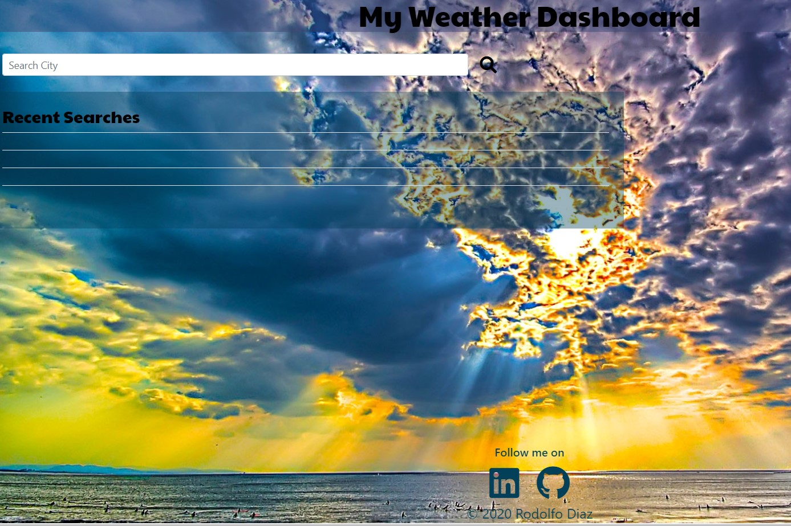
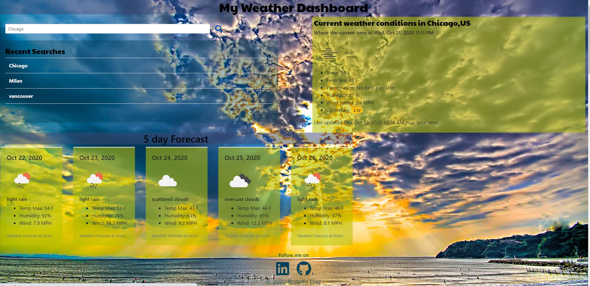
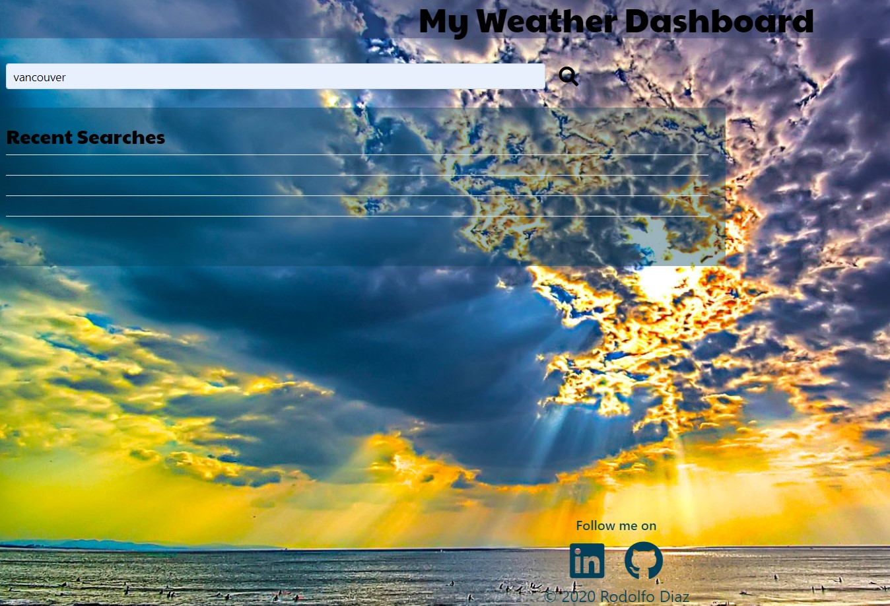
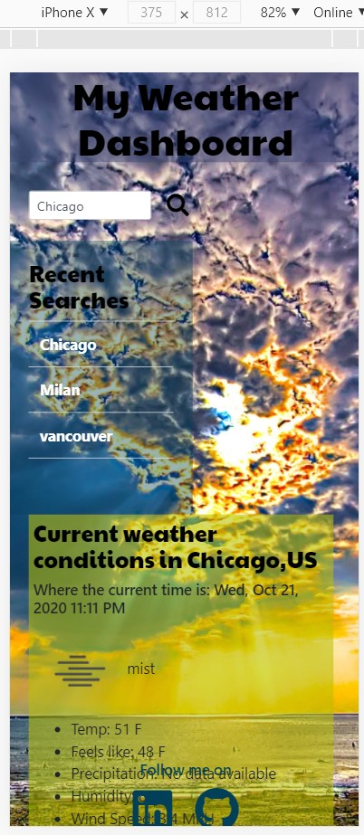
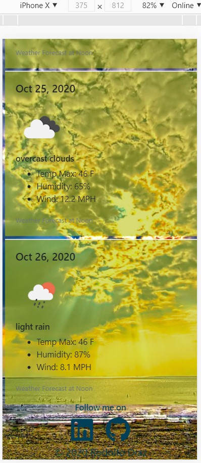
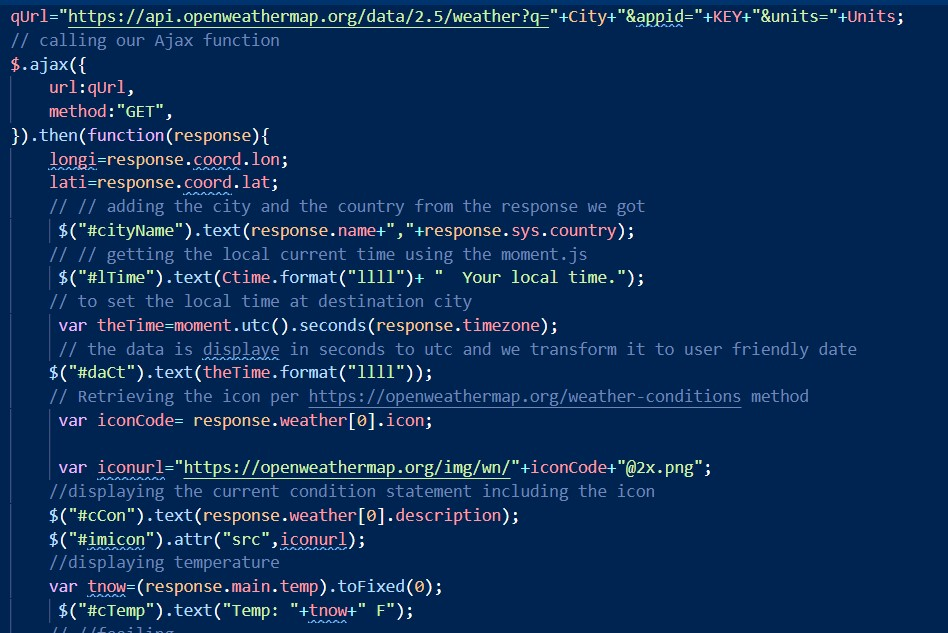
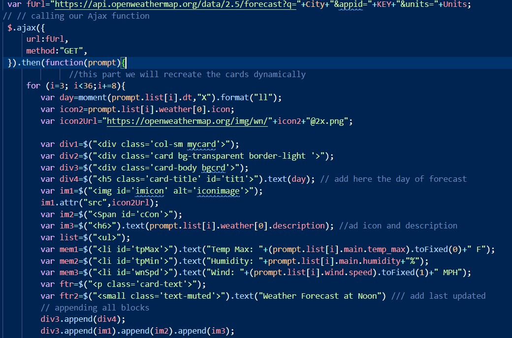

# Weather-Dashboard
Multi City Weather Dashboard Application 

## My approach to this project (Third party web API):
- My need to research and learn different techniques enabled me to think outside the box on this project.
- Moment.js was used extensively on this application to get accurate timing between the searched city and the current local time.
- HTML with minimum content since most of it is dynamically generated. CSS is modified dynamically.
- Powered by Jquery all the CSS is generated and updated to comply with bootstrap 4.0 to give a responsive sense to the app, thinking on mobile first. 

## **  About the application **
* When the page loads:
  - The user is presented with a title of "My Weather Dashboard"
  - A search tex box is displayed and a magnifier glass button is presented for its selection. 
  - If there is no historical data, the rows of recent searches are empty. 
  - an alert is displayed if no city is typed or if there is a misspell.  
  - If there is in fact historical data on the memory the application will load the information for the user to see it. 
  
    - This is an example of the page when it loads 
    

    - When the user selects the city and "clicks" the magnifier/fetch button, the row of recent searches changes its and the localStorage is updated.
    - Here it is an example of this function:
     

    - Example of the user interface:
    
     

* To run the application:
  - This application runs as soon it is deployed
  - user needs to interact selecting the desired city and executing the app by clicking the magnifier grass "search button".

* Style:
- Dynamically generated weather blocks powered by jQuery designed using Bootstrap 4.0 a sober and bold style.
  -Example of mobile deployment:
   
   
 
 * About The CODE. 
  - Designed and Developed with jQuery keeping in mind it simplistic way to facilitate refactoring and debugging. 
  - Extensive use of Moment.js thru this application as a reinforcement exercise of the library (as personal touch).
  - Functions, LocalStorage, JSON , Objects and Events managers are deployed on this project. 
  
  
    - Example of API calls.
    

    - Example of jQuery and API management.
     I

    *This Project contents:
  - Index.html - hosting the web page application all information is updated dynamically from the js file .
  - Script.js - Code for executing the app. 
  - style.css - simple style for the application.
  - README.md - this file.  
 
  =================================================================================
  ### How to best use this 
   - please fork and clone this repository

  ### Special Note for Testing:
  - This application responds to moment.js, make sure to modify your computer clock to test this app.

 contact me at:
 https://github.com/Rodolfod1
 or direct email: rodolfodzr@gmail.com

 Rodolfo Diaz, Oct,10,2020
